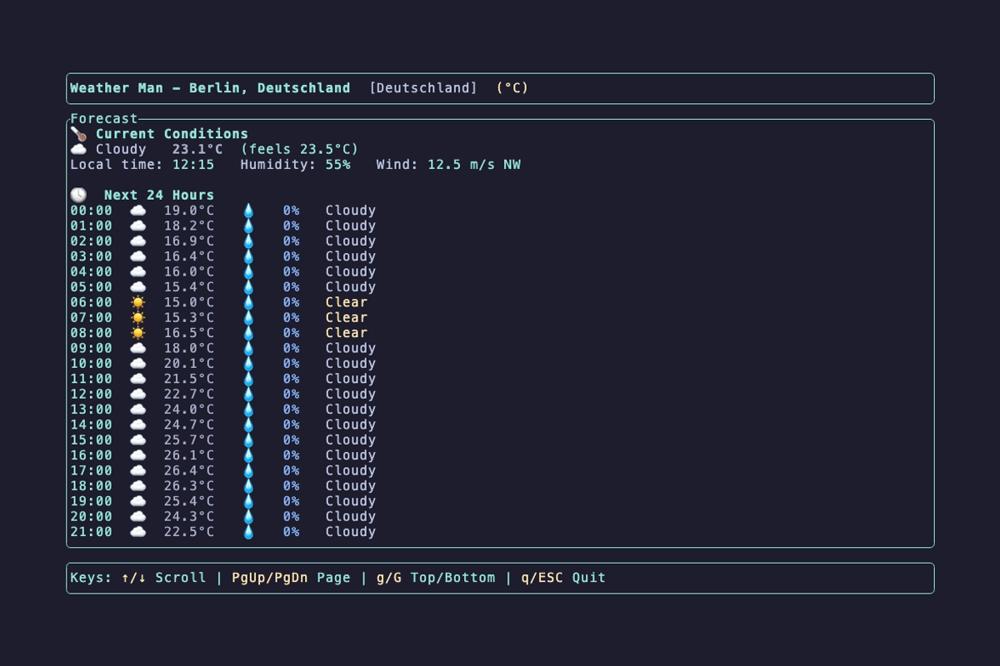

<div align="center">

# 🌤️ Weather Man

**A weather app written entirely in Rust — desktop GUI & terminal UI**

[](https://crates.io/crates/weather_man)
[](https://docs.rs/weather_man-core)
[](LICENSE)

</div>

---

Weather Man ships two front-ends from a single Rust workspace, backed by a shared,
framework-free core that doubles as a **drop-in weather API provider library**.

| Crate | Description |
|-------|-------------|
| [`weather_man`](crates/weather_man-gui) | Desktop **GUI** (Iced) — search a city, current conditions, hourly + 7-day forecast |
| [`weather_man-tui`](crates/weather_man-tui) | Terminal **UI** (Ratatui) — single scrollable page, keyboard-driven, great over SSH |
| [`weather_man-core`](crates/weather_man-core) | Shared **core** — domain models, `WeatherProvider` trait, Open-Meteo backend, geocoding |

Weather data comes from [Open-Meteo](https://open-meteo.com/) (no API key required),
with geocoding via [Nominatim/OpenStreetMap](https://nominatim.openstreetmap.org/).

## Preview

### Terminal UI



### Desktop GUI


## Install

```bash
# Desktop GUI
cargo install weather_man

# Terminal UI
cargo install weather_man-tui
```

## Usage

### GUI

```bash
weather_man
```

Type a city and press Enter to search; toggle °C/°F with the units button.

### TUI

```bash
weather_man-tui                        # auto-detected location
weather_man-tui --location "New York"  # specific city
weather_man-tui --units imperial       # imperial units
weather_man-tui --json                 # JSON output, no TUI
```

Keys: `↑`/`↓` or `j`/`k` scroll · `PgUp`/`PgDn` page · `g`/`G` top/bottom · `q`/`Esc` quit.

## Use the core as a library

`weather_man-core` has no GUI/TUI dependencies and implements a `WeatherProvider`
trait you can swap out:

```rust,no_run
use weather_man_core::{LocationService, WeatherForecaster, WeatherProvider, WeatherConfig};

#[tokio::main]
async fn main() -> anyhow::Result<()> {
    let location = LocationService::new().get_location_by_name("Berlin").await?;
    let provider = WeatherForecaster::new(WeatherConfig::default());
    let forecast = provider.forecast(&location).await?;
    println!("{} hourly, {} daily", forecast.hourly.len(), forecast.daily.len());
    Ok(())
}
```

## Development

This repo uses [`just`](https://github.com/casey/just) as a task runner and
[`nushell`](https://www.nushell.sh) for release scripts.

```bash
just             # list all tasks
just build       # build the workspace
just run-gui     # launch the GUI
just run-tui     # launch the TUI
just test        # run all tests
just check-all   # fmt + clippy + test
just vhs-all     # regenerate demo GIFs (needs vhs)
```

### Release

```bash
just release-preview   # show unreleased commits
just release 0.3.1     # bump, changelog, commit, tag, push → triggers Release workflow
```

Changelogs are generated with [git-cliff](https://github.com/orhun/git-cliff)
from [Conventional Commits](https://www.conventionalcommits.org/).

## License

MIT — see [LICENSE](LICENSE).

## Acknowledgments

- Weather data by [Open-Meteo](https://open-meteo.com/)
- Geocoding by [Nominatim/OpenStreetMap](https://nominatim.openstreetmap.org/)
